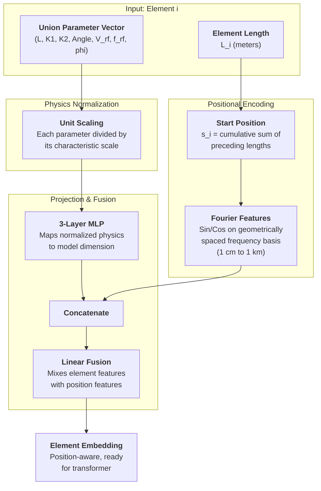
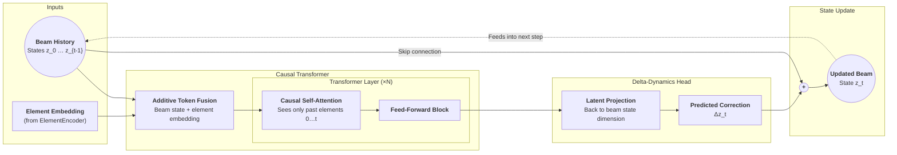

# Latent Beam Dynamics

A latent-space causal transformer that predicts beam distribution evolution through accelerator elements. The beam state is represented as a VAE latent vector, and the model predicts how it transforms through a variable-length sequence of elements (drifts, quadrupoles, RF cavities, etc.).

## Architecture

### ElementEncoder



### LatentBeamTransformer



**ElementEncoder** takes the raw parameter vector for each element `[L, K1, K2, Angle, V_rf, f_rf, phi_rf]`, applies physics-informed normalization, projects through a 3-layer MLP, and mixes in Fourier positional features encoding the element's longitudinal position. A quadrupole with K=0 naturally produces the same embedding as a drift -- no discrete type IDs needed.

**CausalTransformer** is a GPT-style transformer encoder with a causal mask. Each token combines the projected previous beam state with the element embedding. The output is a delta prediction: `z_t = z_{t-1} + Δz_t`.

## Forward Modes

| Mode | `z_gt` | `sampling_prob` | Execution |
|------|--------|-----------------|-----------|
| Teacher forcing | provided | 0.0 | Parallel |
| Scheduled sampling | provided | (0, 1) | Sequential |
| Autoregressive | None | ignored | Sequential |

**Teacher forcing** feeds ground-truth states as input and runs in parallel. **Scheduled sampling** randomly substitutes the model's own (detached) predictions at each step with the given probability, bridging the train/test gap. **Autoregressive** uses only the model's predictions, for inference.

## Configuration

Model and training hyperparameters are defined in `config.yaml`:

```yaml
model:
  latent_dim: 64       # VAE latent dimension
  d_model: 256         # transformer hidden dimension
  n_layers: 6          # transformer layers
  n_heads: 8           # attention heads
  n_freq: 32           # Fourier frequency pairs
  element_dim: 7       # raw element parameter dimension
  lambda_min: 0.01     # min positional wavelength (m)
  lambda_max: 1000.0   # max positional wavelength (m)
  dropout: 0.1
  mlp_ratio: 4         # feed-forward expansion ratio

training:
  epochs: 50
  batch_size: 32
  learning_rate: 3.0e-4
  weight_decay: 1.0e-2
  grad_clip: 1.0
  scheduled_sampling_warmup: 10
  scheduled_sampling_k: 0.05
```

## Usage

```python
from model import ModelConfig, LatentBeamTransformer

config = ModelConfig(latent_dim=64, d_model=256)
model = LatentBeamTransformer(config)

# Training (teacher forcing)
z_pred = model(z0, x_raw, z_gt=z_gt, sampling_prob=0.0)

# Training (scheduled sampling)
z_pred = model(z0, x_raw, z_gt=z_gt, sampling_prob=0.3)

# Inference
z_pred = model(z0, x_raw)
```

## Setup

Requires Python >= 3.13 and PyTorch with CUDA 12.4.

```bash
uv sync
uv run python main.py
```

Run the model sanity check:

```bash
uv run python model.py
```
